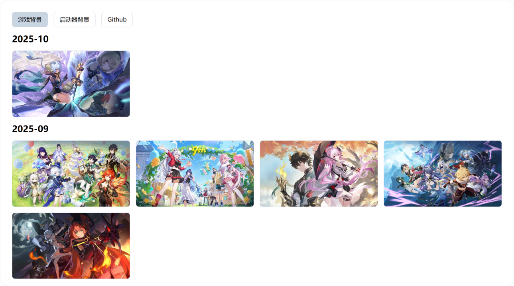

  <h1>米哈游启动器背景收集</h1>
  

    在线访问
    <a href="https://hyp-bg.amarea.cn/">
      EdgeOne
    </a>
    |
    <a href="https://hoyoplay-background.vercel.app/">
      Vercel
    </a>
  

  

## 项目说明

- 自动抓取米哈游启动器背景更新，按照月份分组展示
- 历史数据起始时间为2024年6月
- 基于 [PhotoSwipe](https://github.com/dimsemenov/photoswipe) 的图片浏览器
- 支持将鼠标移至封面上方预览动态背景
- 通过附加 OSS 参数实现快速加载低分辨率预览图片

## 包含背景类型

- **游戏选择界面背景**
2560*1440 分辨率，无水印， WebP-lossless 编码

- **启动器背景**
2560*1440 分辨率，有部分文字和水印，WebP-lossless 编码

- **启动器动态背景**
1920*1080 分辨率，30/60帧，WebM-VP9 编码

> 有小部分图片为 WebP-lossy 编码，清晰度偏低，抓取到的原始图片就是这样的，无法解决

## License

[MIT License](./LICENSE)